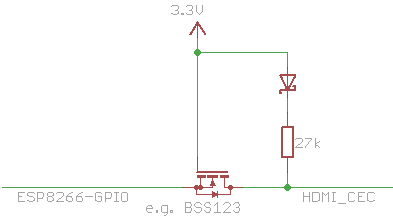

# CEC
Arduino library for HDMI CEC communication

Original code at: https://code.google.com/archive/p/cec-arduino/ (c) Phil Burr and Andrew N. Carr

This is an Arduino library which implements the HDMI v1.3a CEC wire protocol which allows communication with HDMI CEC capable devices. A typical usage scenario would be a Home Theater PC environment which uses HDMI but does not support CEC. This would allow the HTPC to communicate with other HDMI CEC equipment.

This library version was adapted to run on ESP8266 boards, e.g. NodeMCU. It is designed to use a single GPIO pin and, since ESP8266 has 3.3V GPIOs, needs a much simpler interface circuit than in the original library version.

